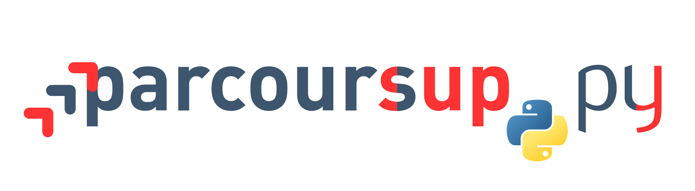

# :fr: Un clone en Python 3 de [Parcoursup](http://www.parcoursup.fr/), écrit à but didactique
<a href="https://perso.crans.org/besson/publis/ParcourSup.py/"></a>

> [Écrit par](AUTHORS) deux doctorants de [l'équipe SCEE](http://www-scee.rennes.supelec.fr/wp/phd/) de [CentraleSupélec, campus de Rennes](http://www.rennes.centralesupelec.fr/), [Lilian Besson (@Naereen)](https://github.com/Naereen) et [Bastien Trotobas (@BastienTr)](https://github.com/BastienTr), et d'[autres collaborateur-trice-s](https://github.com/Naereen/ParcourSup.py/graphs/contributors).

## Présentation

Ce dépôt contient un clone (presque complet) des algorithmes régissant la [plateforme Parcoursup](http://www.parcoursup.fr/), qui gère depuis 2018 les affectations des élèves de classe de Terminale (🇫🇷 dans les lycées en France) dans leurs formations dans l'enseignement supérieur.

Les algorithmes et l'implémentation officielle (en Java) ont été distribués en accès libre, et sous licence libre (GPL), en mai 2018. En 2018, ils étaient hébergés sur [ce site (framagit.org/parcoursup/algorithmes-de-parcoursup)](https://framagit.org/parcoursup/algorithmes-de-parcoursup).

- Nous proposons ici une implémentation complète des différents algorithmes de Parcoursup, écrite en Python 3, dans un style très clair, avec des commentaires, et [une documentation](https://perso.crans.org/besson/publis/ParcourSup.py/parcoursup.html#module-parcoursup). [](https://parcoursuppy.readthedocs.io/fr/latest/?badge=latest)
- Nous avons pour objectif de comprendre et d'expliquer ces algorithmes, en utilisant au maximum des notions et des modules Python qui soient abordables et compréhensibles par des élèves de classes préparatoires scientifiques (typiquement des MPSI).
- *Note* : Vous pouvez contribuer si vous le souhaiter ! [Une erreur à signaler ?](https://github.com/Naereen/ParcourSup.py/issues/new), ou [une contribution possible](https://github.com/Naereen/ParcourSup.py/pulls/) ? :clap: Merci d'avance !

---

## [Plan de bataille](TODO.md)
> Pour le développement en cours.

## Explications

- Pour l'instant, nous avons implémenté dans le dossier [`parcoursup/`](parcoursup/) un clone complet du code Java initial, écrit en Python 3.
- Et dans le dossier [`notebooks/`](notebooks/) nous proposons des implémentations simplifiées des principaux algorithmes, écrites sans dépendances et dans un style très didactique, avec des visualisations interactives afin de permettre à tout le monde d'expérimenter un peu et de visualiser le comportement des algorithmes. L'accent est mis sur la compréhension rapide de l'influence des différents paramètres numériques.

- TODO expliquer l'algorithme dans les grandes lignes, avec notre propre vocabulaire, ici.

## Organisation de ce dépôt

- Des visualisations sont dans [le dossier `notebooks/`](notebooks/). TODO encore à travailler !
- Le code des algorithmes est [dans le dossier `parcoursup/`](parcoursup/), comme le code Java initial, c'est découpé en deux modules, [`ordreappel`](parcoursup/ordreappel) et [`propositions`](parcoursup/propositions),
- Les (exemples de) données synthétiques générées sont [dans le dossier `donnees/`](donnees/),
- Des tests (plusieurs centaines) sont présents dans le dossier [`tests/`](tests/), inspirés par [ce projet](https://github.com/JosePaumard/tests-pour-parcoursup),
- Une documentation de notre implémentation complète est disponible en ligne, [sur la page suivante](https://perso.crans.org/besson/publis/ParcourSup.py/), construite avec Sphinx à partir des fichiers présents dans [le dossier `docs/`](docs/),
- Des utilitaires sont [dans le dossier `utils/`](utils/),

## Démonstration dans un [notebook Jupyter](https://www.Jupyter.org/)
- Des visualisations sont dans [le dossier `notebooks/`](notebooks/).

[](https://mybinder.org/v2/gh/Naereen/ParcourSup.py/master?filepath=notebooks%2FParcourSup.py_version_simplifiee.ipynb)

---

## Documentation officielle et ressources

- La page officielle de présentation de Parcoursup est [ici](http://www.enseignementsup-recherche.gouv.fr/pid37384/parcoursup-plateforme-admission-dans-superieur.html) (en 2018).


Communications journalistiques, entre le 23 mai 2018 et le 15 juillet 2018 :

- Les indicateurs quotidiennement publiés par le ministère sont sur [cette page là](http://www.enseignementsup-recherche.gouv.fr/cid130714/tableaux-de-bord-des-indicateurs-de-parcoursup.html) (en juin 2018).

- Cette carte qui montre jour après jour les résultats donnés par Parcoursup : [statistiques.parcoursup.fr](http://statistiques.parcoursup.fr/).
  <span style="color:red;">C'est bizarre, la carte marchait le 5 juin, elle semble désactivée depuis mi-juillet !</span>
  > Nous voulons proposer notre propre carte de visualisation, [c'est en cours](https://github.com/Naereen/ParcourSup.py/issues/8)…


Des détails sur les algorithmes :

- [Ce document texte](https://framagit.org/parcoursup/algorithmes-de-parcoursup/blob/master/doc/implementation.txt) et [cet autre document PDF](https://framagit.org/parcoursup/algorithmes-de-parcoursup/blob/master/doc/presentation_algorithmes_parcoursup.pdf) donnent plein d'explications.

- [Ce texte du Journal Officiel](https://www.legifrance.gouv.fr/affichTexte.do?cidTexte=JORFTEXT000036748597&dateTexte=20180724) montre l'autorisation donnée par la CNIL pour la création de la base de données pour Parcoursup, et détaille un peu toutes les informations stockées pour le service. Il est important de garder en tête que ces données ne sont **pas** utilisées par les algorithmes de Parcoursup, qui n'utilisent qu'un identifiant unique et anonyme pour identifier chaque candidat-e.

Autres ressources, moins techniques mais plus pédagogiques :

- [Le dossier de presse du ministère](http://cache.media.enseignementsup-recherche.gouv.fr/file/Parcoursup/73/7/DP_Parcoursup_-_Au_service_de_l_orientation_et_de_la_reussite_des_futurs_etudiants_936737.pdf) pour Parcoursup

- Ces articles sur des blogs du Monde: sur [ingenuingenieur.blog.lemonde.fr](http://ingenuingenieur.blog.lemonde.fr/2018/05/29/parcoursup-2018-les-dessous-de-lalgorithme-racontes-par-ses-createurs/), sur [enseigner.blog.lemonde.fr](http://enseigner.blog.lemonde.fr/2018/04/03/parcoursup-naivete-habilete-ou-machiavelisme-gouvernemental/) ou sur [binaire.blog.lemonde.fr](http://binaire.blog.lemonde.fr/2018/06/05/la-transparence-a-lecole-de-parcoursup/).

- [Cet autre article par Clémence Réda est instructif](https://theconversation.com/apb-la-vie-apres-le-bac-66848).

----

## Exemples
### Installation

Ces lignes de [Bash](https://www.gnu.org/software/bash/) (à exécuter sur une machine type GNU/Linux ou un Mac avec les outils standards) clone ce dépôt, et installent un [`virtualenv` Python](https://virtualenv.pypa.io/) et installent [les dépendances](requirements.txt) dans cet environnement virtuel :

```bash
cd /tmp/
git clone https://GitHub.com/Naereen/Parcoursup.py
cd Parcoursup.py/
make install
```

> Note : Il n'est pas nécessaire d'utiliser un `virtualenv`, mais c'est recommandé. Vous pouvez simplement installer les modules requis avec `sudo pip install -r requirements.txt`.

> Note : notre code n'est pas spécifiquement écrit pour une machine utilisant GNU/Linux, et il devrait fonctionner sur n'importe quelle plateforme qui supporte Python 3.6 (Microsoft Windows et Mac OS X notamment). Il est testé sous GNU/Linux (XUbuntu) *et* sous Microsoft Windows 7. [N'hésitez pas à signaler un problème](https://github.com/Naereen/ParcourSup.py/issues/new), si besoin. :clap: Merci d'avance !

### Tests

Les tests qui reproduisent ([presque](https://github.com/Naereen/ParcourSup.py/issues/1)) parfaitement [les données d'exemples](donnees) peuvent être exécutés avec les deux commandes suivantes :

- Ordres d'appel :
```bash
$ . env/bin/activate ; python3 ./parcoursup/ordreappel/__init__.py
...
```

- Proposition de vœux :
```bash
$ . env/bin/activate ; python3 ./parcoursup/propositions/__init__.py
...
```
- Ces deux tests prennent environ 30 secondes chacun.

> Note : Il n'est pas nécessaire d'utiliser un `virtualenv`, mais c'est recommandé. Vous pouvez simplement faire les tests avec `python3 ./parcoursup/ordreappel/__init__.py` et `python3 ./parcoursup/propositions/__init__.py`.

- Des tests supplémentaires seront bientôt ajoutés (voir [#3](https://github.com/Naereen/ParcourSup.py/issues/3)).

----

## À propos
### Language et versions ?
[Python v3.6+](https://docs.python.org/3.6/).
Avec les [modules suivants](requirements.txt) :

- [Numpy](http://numpy.org/) pour les tableaux,
- [La bibliothèque standard](https://docs.python.org/3.6/) pour tout le reste.
- [ipython](http://ipython.org), [Jupyter](https://www.jupyter.org/) pour les notebooks.
- [tqdm](https://github.com/tqdm/tqdm#usage) sont optionnels.

### :scroll: Licence ? [](https://github.com/Naereen/Parcoursup.py/blob/master/LICENSE)
Code libre, [sous licence MIT](https://lbesson.mit-license.org/) (file [LICENSE](LICENSE)).
© [Lilian Besson](https://GitHub.com/Naereen) et [Bastien Trotobas](https://github.com/BastienTr) et collaborateur-trice-s, 2018.

[](https://www.python.org/)
[](https://docs.python.org/3/)
[](https://GitHub.com/Naereen/Parcoursup.py/graphs/commit-activity)
[](https://GitHub.com/Naereen/ama)
[](https://GitHub.com/Naereen/Parcoursup.py/)

[](http://ForTheBadge.com)
[](https://GitHub.com/)
[](https://www.python.org/)
[](https://GitHub.com/Naereen/)