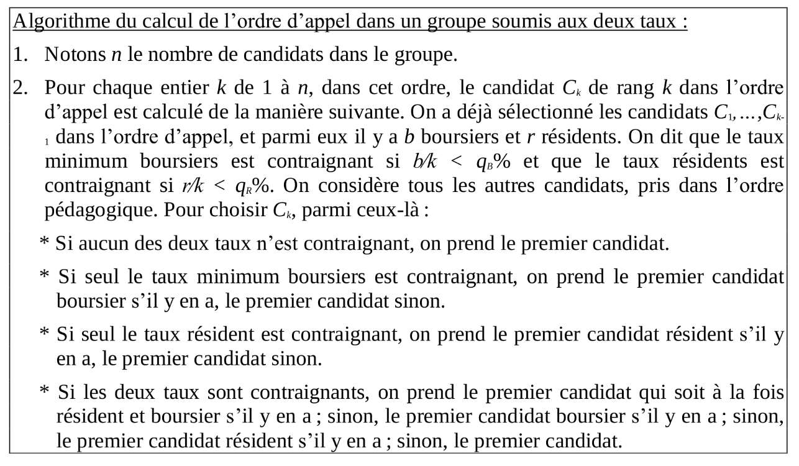

# :fr: Un clone en Python 3 de [Parcoursup](http://www.parcoursup.fr/), écrit à but didactique

> [Écrit par](AUTHORS) [Lilian Besson (@Naereen)](https://github.com/Naereen) et [Bastien Trotobas (@BastienTr)](https://github.com/BastienTr), et d'autres collaborateur-trice-s.

## Notebooks

Ce dossier contient des ressources supplémentaires pour expliquer les algorithmes de Parcoursup sous forme de [Notebooks Jupyter](https://jupyter.org/).

## Version simplifiée des algorithmes de ParcourSup

### 1) Calcul de l'ordre d'appel
> C'est la partie qui est implémentée [dans ce dossier `parcoursup/ordreappel`](../parcoursup/ordreappel/).

- [Ce notebook](ParcourSup.py_version_simplifiee.ipynb) étudie l'algorithme 1 de calcul des ordres d'appels. Pour une formation, avec N candidats-es l'ayant demandés, les professeurs de la formation classent les N candidats-es, et ensuite l'algorithme s'occupe de réordonner certains vœux en fonction du taux minimum de boursiers-ères et du taux minimum de résidents-entes.

  + L'algorithme est assez simple s'il n'y a que la contrainte du taux de boursiers-ères à respecter :
    

  + L'algorithme est plus compliqué s'il y a la contrainte du taux de boursier-ère-s et la contrainte du taux de résident-e à respecter, mais c'est très similaire. La seule chose à savoir est qu'en cas d'incompatibilité des deux contraintes, la priorité est donnée à la première contrainte sur les boursier-ère-s :
    

- Les deux exemples suivants de visualisations montrent l'interface de visualisation interactive que l'on est en train de construire dans cet exemple :

  + Si on regarde une liste de vœux, on représente en gris les vœux ni boursiers ni résidents, en rouge les boursiers, en bleu les résidents et en violet les boursiers résidents. La vidéo montre que l'interface interactive permet de créer des listes de vœux triées aléatoirement, et montre l'influence des deux taux (minimum de boursiers et minimum de résidents) sur le classement final.
    

  + Cette fois on a aussi le contrôle d'un vœu en particulier, représenté en couleur plus vive. La vidéo montre l'influence des deux taux (minimum de boursiers et minimum de résidents) sur le classement final de ce vœu en comparaison à d'autres.
    

- Voici un lien qui ouvre le notebook avec [MyBinder](https://mybinder.org/), pour vous laisser exécuter le code par vous-même.
  

- Voici un lien qui ouvre le notebook avec [Google Colab](https://colab.research.google.com/notebook), pour vous laisser exécuter le code par vous-même.
  

### 2) Calcul des propositions
> C'est la partie qui est implémentée [dans ce dossier `parcoursup/propositions`](../parcoursup/propositions/).

- TODO

---

## Exemples d'utilisation de l'implémentation complète de ParcourSup.py

- TODO

---

### :scroll: Licence ? 
Code libre, [sous licence MIT](https://lbesson.mit-license.org/) (file [LICENSE](LICENSE)).
© [Lilian Besson](https://GitHub.com/Naereen) et [Bastien Trotobas](https://github.com/BastienTr) et collaborateur-trice-s, 2018.

