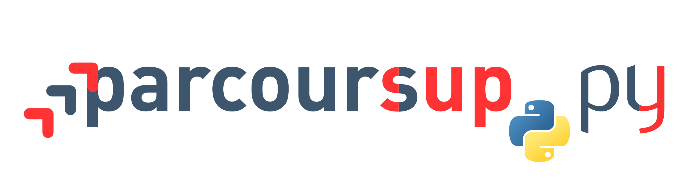

# :fr: Un clone en Python 3 de [Parcoursup](http://www.parcoursup.fr/), écrit à but didactique
<a href="https://perso.crans.org/besson/publis/ParcourSup.py/"></a>

> [Écrit par](AUTHORS) [Lilian Besson (@Naereen)](https://github.com/Naereen) et [Bastien Trotobas (@BastienTr)](https://github.com/BastienTr), et d'autres collaborateur-trice-s.

# Tests basés sur le BDD
## Avec [behave](https://behave.readthedocs.io/)

- Ces fichiers de tests (fichiers `*.features`) viennent de [ce dépôt](https://github.com/JosePaumard/tests-pour-parcoursup).
- Les fichiers en Python utilisent [l'implémentation de ParcourSup.py](../parcoursup).

## Comment lancer ces tests ?
- Il faut installer le module `behave` :
  ```bash
  $ sudo pip3 install behave
  ```
- Et ensuite vous pouvez utiliser le [`Makefile`](Makefile) fournit :
  ```bash
  $ make tests
  ```
  qui va lancer tous les tests.

----

## Tests pour `ordreappel`
> Il s'agit de tester l'algorithme qui calcule l'ordre d'appel pour une liste de vœux, en fonction des deux taux de boursier-ère-s et de résident-e-s.

- [x] Il y a [12 tests](ordreappel-4-1.feature) qui ne considèrent que la contrainte du taux de boursier-ère-s.
- [x] Il y a [260 tests](ordreappel-4-2.feature) qui considèrent les deux contraintes, du taux de boursier-ère-s et du taux de résident-e-s.
- [x] Le fichier Python qui implémente le lien entre la bibliothèque et ces tests est [`steps/ordreappel_steps.py`](steps/ordreappel_steps.py).

## Tests pour `propositions`
> Il s'agit de tester deux algorithmes : d'abord le calcul de l'assiette d'admission Bmax, puis de la bonne gestion des affectations dans les internats.

- [x] Il y a [72 tests](propositions-5-1-bmax.feature) qui testent le bon calcul de l'assiette d'admission Bmax.
- [ ] Il y a [64 tests](ordreappel-4-2.feature) qui testent la bonne gestion des internats.
- [ ] Le fichier Python qui implémente le lien entre la bibliothèque et ces tests est [`steps/propositions_steps.py`](steps/propositions_steps.py).

----

## Exemples
Voir les fichiers suivants pour des exemples de sorties de la commande précédente :

- [x] [ordreappel-4-1_tests.txt](../logs/ordreappel-4-1_tests.txt)
- [x] [ordreappel-4-2_tests.txt](../logs/ordreappel-4-2_tests.txt)
- [x] [propositions-5-1-bmax_tests.txt](../logs/propositions-5-1-bmax_tests.txt)
- [ ] TODO [propositions-5-1-internat-1_tests.txt](../logs/propositions-5-1-internat-1_tests.txt)

----

## Davantage de tests ?
- Voir [ce ticket](https://github.com/Naereen/ParcourSup.py/issues/3).

----

## À propos
- Merci à [José Paumard](https://github.com/JosePaumard/) pour cette belle initiative.

---

### :scroll: Licence ? [](https://github.com/Naereen/badges/blob/master/LICENSE)
Code libre, [sous licence MIT](https://lbesson.mit-license.org/) (file [LICENSE](LICENSE)).
© [Lilian Besson](https://GitHub.com/Naereen) et [Bastien Trotobas](https://github.com/BastienTr) et collaborateur-trice-s, 2018.


[](https://GitHub.com/Naereen/Parcoursup.py/graphs/commit-activity)
[](https://GitHub.com/Naereen/ama)
[](https://GitHub.com/Naereen/Parcoursup.py/)

[](http://ForTheBadge.com)
[](https://GitHub.com/)
[](https://www.python.org/)
[](https://GitHub.com/Naereen/)
